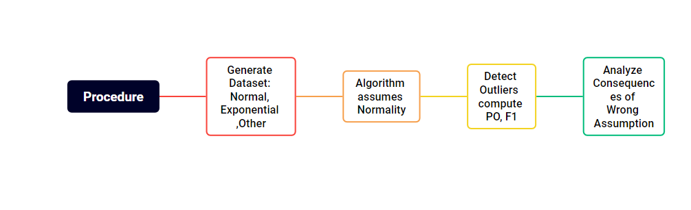

# EXPERIMENTATION: Consequences of Wrong Assumptions in Data

Welcome! This repository is a small journey through some experiments I designed to answer a simple but important question: 

> What happens when an algorithm assumes the data is normal, but in reality, it is not?  

Inspired by the **Lady Tasting Tea experiment**, these experiments let us test this assumption in a controlled way using synthetic datasets. Along the way, we visualize how wrong assumptions can affect algorithm behavior and learn why careful preprocessing and understanding of data matter.

---

## Why This Matters

- **Explore the risks** of misinterpreting real data as outliers  
- **Visualize consequences** of incorrect assumptions on anomaly detection  
- **Document structured experimentation** for portfolio purposes  

---

## Core Question

> What is the cost of assuming normality when the data follows a different distribution?  

---

## Approach

- **Generate synthetic datasets**:  
  - Normal (baseline)  
  - Exponential (tests assumption violation)  
  - Optional: uniform, log-normal, bimodal  

- **Feed datasets to an anomaly detection algorithm** assuming normality  

- **Measure impact**:  
  - Percentage of detected outliers (PO)  
  - F1-score for detection accuracy  

---

## Conceptual Diagram

 

---

## Figures and Detailed Observations

Here is a detailed walkthrough of the figures generated by the experiments. For each figure, you’ll see **what the data represents, what the algorithm does, and the interpretation of the results**.

### Figure 1 – Wrong Assumptions & Outliers

 

This figure illustrates the core principle: when an algorithm assumes normality, data from an exponential distribution can appear as outliers. These “false outliers” are not errors in the data—they are natural values from the exponential distribution—but the algorithm flags them incorrectly. The take-home message is that **wrong assumptions can mislead detection** and inflate the number of outliers.

---

### Figure 2 – Method Performance Across Distributions

 

This figure compares the algorithm’s performance across multiple distributions. As expected, **Gaussian data aligns with the algorithm’s assumptions** and yields the highest accuracy. Exponential or other non-normal distributions lead to lower performance. This shows **the algorithm is sensitive to the underlying data distribution**, and violations of assumptions reduce reliability.

---

### Figure 3 – ROC Curve (True Positive Rate vs False Positive Rate)

 

The ROC curve plots the **trade-off between true positives (correctly flagged outliers) and false positives (normal points flagged incorrectly)**. A higher curve means better detection across thresholds. This figure helps us see how varying the threshold affects detection accuracy and highlights **the cost of assuming the wrong distribution**.

---

### Figure 4 – Gaussian Data Before & After Normalization (Z-score)

 

Left: Raw Gaussian data. Right: Data normalized using Z-score. Normalization centers the data and scales it to unit variance. Some points appear more scattered after normalization because their relative distances changed, which **affects how the algorithm perceives outliers**. This figure demonstrates that **preprocessing can alter detection outcomes even on “correct” distributions**.

---

### Figure 5 – Exponential Data Detection

 

Left: Original exponential data, with no true outliers. Right: Points flagged by the anomaly detection algorithm assuming Gaussian distribution. Many points are incorrectly flagged due to skewness in the exponential distribution. This highlights **the consequences of applying a model with incorrect assumptions**.

---

### Figure 6 – Workflow Summary

 

A conceptual diagram showing the experimental procedure: dataset generation, anomaly detection under assumed normality, and analysis of consequences. This figure ties all experiments together and shows the **structured approach** taken to answer the core question.

---

## Navigate the Experiments

| Folder | Description |
|--------|-------------|
| `exp1_anomaly_normal_vs_exponential` | Test anomaly detection with normal vs exponential datasets |
| `exp2_...` | Other experiments exploring assumption violations |
| `README.md` | This overview file for the repository |

---

## Key Takeaways

- **Wrong assumptions** can lead to misinterpreting normal data as outliers  
- **Controlled experiments** quantify these risks  
- **Normalization and scaling** can alter algorithm behavior  
- **Structured workflow** allows testing assumptions before applying algorithms to real data  

---

This README now acts as a **self-contained portfolio presentation**: a friendly introduction, conceptual diagram, detailed figure explanations, and summary takeaways.  

