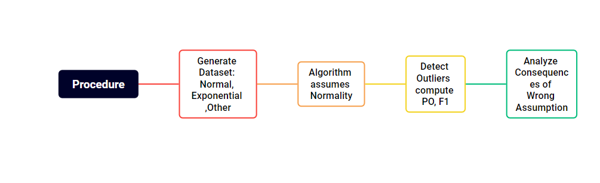

# EXPERIMENTATION: Consequences of Wrong Assumptions in Data

This repository contains a set of experiments exploring **the impact of wrong assumptions on data distributions**. Inspired by the **Lady Tasting Tea experiment**, these experiments investigate what happens when algorithms assume data is normal but it may not.

## Why This Matters

- **Understand risks** in anomaly detection and other algorithms  
- **Visualize consequences** of misinterpreting real data as outliers  
- **Show structured experimentation** for portfolio purposes  

## Core Question

> What is the cost of assuming normality when the data follows a different distribution?  

## Approach

- **Generate synthetic datasets:**  
  - Normal (baseline)  
  - Exponential (tests assumption violation)  
  - Optional: uniform, log-normal, bimodal  

- **Feed datasets to an anomaly detection algorithm** assuming normality  

- **Measure impact:**  
  - Percentage of detected outliers (PO)  
  - F1-score for accuracy of detection  

## Inspiration: Lady Tasting Tea

Just like the Lady Tasting Tea experiment tested a hypothesis with controlled trials, these experiments use **controlled synthetic data** to test algorithm assumptions. 

## Conceptual Diagram

 

## Navigate the Experiments

| Folder | Description |
|--------|-------------|
| `exp1_anomaly_normal_vs_exponential` | Test anomaly detection with normal vs exponential datasets |
| `exp2_...` | Other experiments exploring assumption violations |
| `README.md` | This overview file for the repository |

## Key Takeaways

- **Wrong assumptions** can lead to misinterpreting normal data as outliers  
- **Controlled experiments** quantify these risks  
- **Provides structured workflow** to test assumptions before applying algorithms to real data
