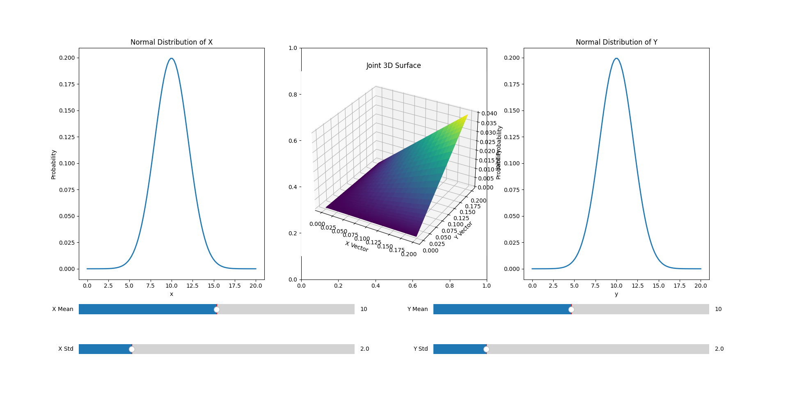
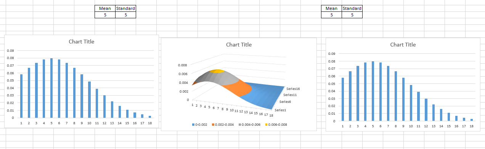

# EXPERIMENTATION: 2D Distribution Visualization and Interactive Exploration

In this experiment, we explore the behavior of **two-dimensional distributions** generated from independent normal variables. Inspired by earlier work in anomaly detection and probability, the goal is to gain intuition about how the **parameters of each variable—the mean and standard deviation—affect the shape and height of the resulting 2D surface**.  

By visualizing these distributions, we can better understand the interaction between independent variables and the formation of a joint probability surface. The central question driving this experiment is simple yet powerful:  

> How do changes in the mean and standard deviation of each variable influence the combined distribution?  

---

## Approach

To investigate this question, we:

- Generate two independent normal distributions for variables X and Y.
- Compute a 2D surface based on the product of their probability densities.
- Visualize the resulting 2D surface using both static (Excel) and Python-generated interactive plots.
- Employ **sliders** in Python to adjust the mean and standard deviation in real-time, allowing interactive exploration.

This approach provides **immediate visual intuition** for how these changes propagate in the joint distribution and emphasizes the value of interactive visualization in learning probability concepts.

---

## Figures

### Figure 1: Python-Generated 2D Distribution with Sliders

  

**Explanation:**  
This figure shows the 2D surface generated by multiplying the probability densities of X and Y. You can see how the peak corresponds to the combination of the means, and the spread is influenced by the standard deviations. Using sliders, we can adjust these parameters interactively to observe how the joint distribution changes in real-time.

---

### Figure 2: Excel-Generated 2D Distribution

  

**Explanation:**  
This figure demonstrates the same concept as Figure 1 but generated manually in Excel. It provides a visually smooth 2D surface that is easy to interpret. Comparing Figure 1 and Figure 2 allows us to appreciate the differences between interactive Python visualizations and static representations, while confirming the underlying probability behavior remains consistent.

---

## Key Takeaways

- **Parameter Sensitivity:** The joint distribution is highly sensitive to changes in mean and standard deviation for each variable.
- **Interactive Learning:** Sliders provide hands-on exploration, improving understanding of multivariate distributions.
- **Visual Intuition:** Seeing the peaks, spreads, and surface shapes solidifies understanding of how independent variables combine probabilistically.

---

## Next Steps

- Experiment with different ranges and step sizes for sliders.
- Add more distributions (e.g., exponential, uniform) to compare with the normal case.
- Save snapshots for documentation and portfolio purposes.
