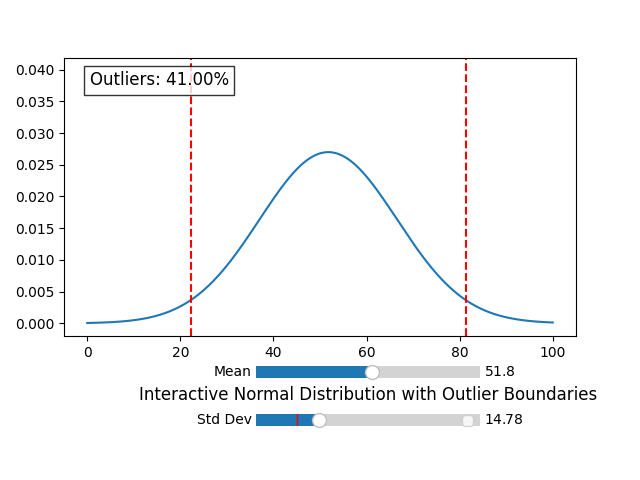
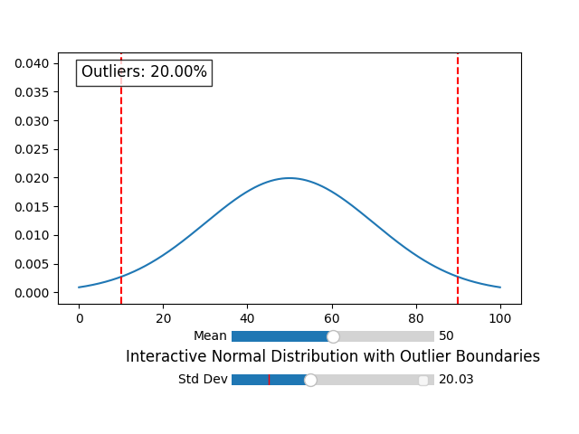
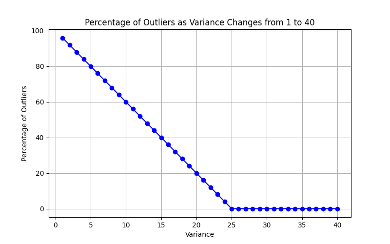

# EXPERIMENTATION 8: Refining the Concept of Outliers

In this experiment, we explore the behavior and definition of **outliers** in normal distributions. The goal is to understand how standard deviation affects the detection of outliers and to illustrate the concept using visualizations. This follows from observations in anomaly detection, where algorithms often assume data is normally distributed and compute outliers accordingly.

## Motivation

- The concept of an **outlier** can be subtle and context-dependent.  
- In practice, we often assume data comes from a normal distribution, but how does that affect what we consider “outliers”?  
- By experimenting with different variances, we investigate how the **percentage of outliers changes**.

## Central Questions

1. What is an **Outlier**?  
2. How does the normal distribution assumption influence what we label as an outlier?  
3. How does increasing variance impact the proportion of detected outliers?  

## Approach

- Generate normal distributions with fixed mean and varying standard deviations.  
- Define outliers based on ±2 standard deviations from the mean.  
- Count the number and percentage of outliers as the variance changes.  
- Visualize the distributions and outlier boundaries interactively.

## Figures

### Figure 1: Normal Distribution with Std = 10

- The red dashed lines indicate the lower and upper outlier boundaries (±2σ).  
- Outliers are the points outside these boundaries.  
- This figure shows a relatively narrow distribution, resulting in a **higher percentage of outliers**.

### Figure 2: Normal Distribution with Std = 20

- Increasing the standard deviation widens the distribution.  
- The ±2σ boundaries expand with the standard deviation.  
- Consequently, fewer points fall outside the bounds, leading to a **lower percentage of outliers**.  
- This demonstrates a counterintuitive but theoretically consistent result.

### Figure 3: Percentage of Outliers vs. Increasing Variance

- The graph shows how the proportion of outliers decreases as variance increases from 1 to 40.  
- Even though the distribution spreads out, the outlier thresholds grow proportionally with standard deviation.  
- This behavior illustrates that **outlier detection is relative to the standard deviation**, not absolute spread.

## Key Takeaways

- Outlier definitions depend heavily on the method used (IQR, standard deviations, etc.).  
- Using standard deviation-based thresholds, increasing variance reduces the percentage of outliers.  
- Visualization and interactive sliders help build intuition about the impact of variance on outlier detection.  

## How to Reproduce

1. Run `experiment_8_outliers.py` to generate interactive plots.  
2. Adjust the sliders for mean and standard deviation to see how outlier boundaries and percentages change.  
3. Observe the resulting 1D distributions and the calculated outlier percentages.

---

This experiment emphasizes the importance of understanding **assumptions behind statistical definitions**. By visualizing the effects of variance, we gain deeper insight into the dynamic concept of outliers.
